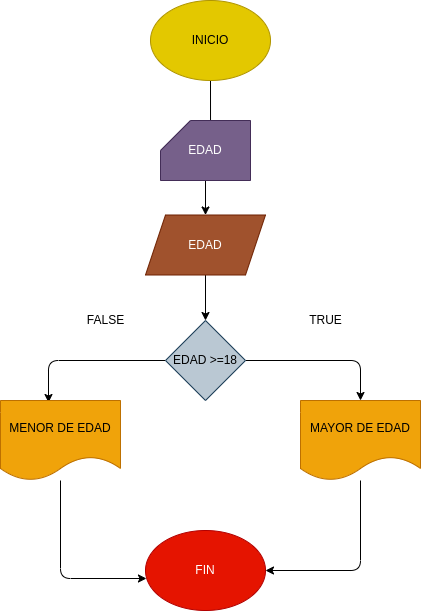

# EJERCICIO 1 ESTRUCTURAS CONDICIONALES
## Programa para verificar si usted es mayor de edad
## ANALISIS
### Definición de variables

edad: edad de la persona
si la persona tiene 18 o mas años es considerada mayor de edad

## DISEÑO

