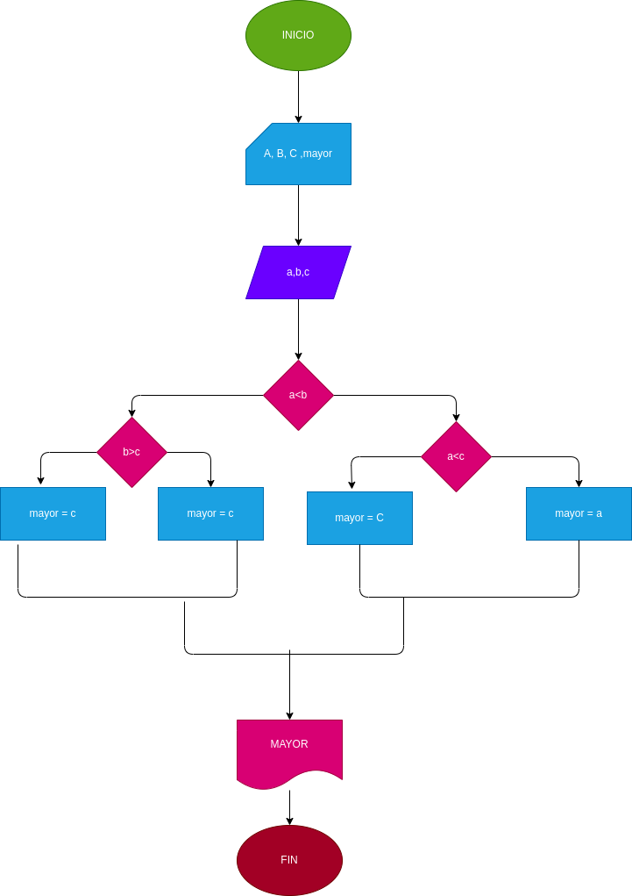

# EJERCICIO 2 ESTRUCTURAS CONDICIONALES
## Programa para hallar el mayor de tres números enteros
## ANALISIS
### Definición de variables

a: primer numero
b: segundo número
c: tercer numero
mayor: numero mayor

Se comparan los tres valores entre si para hallar el mas grande

## DISEÑO

